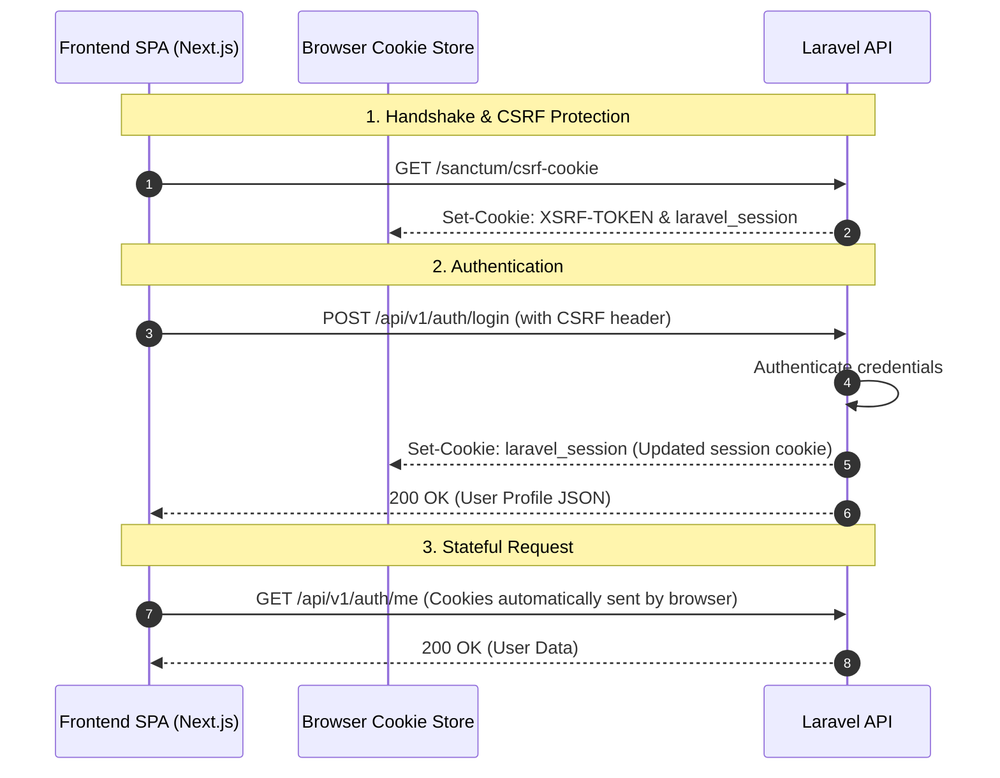
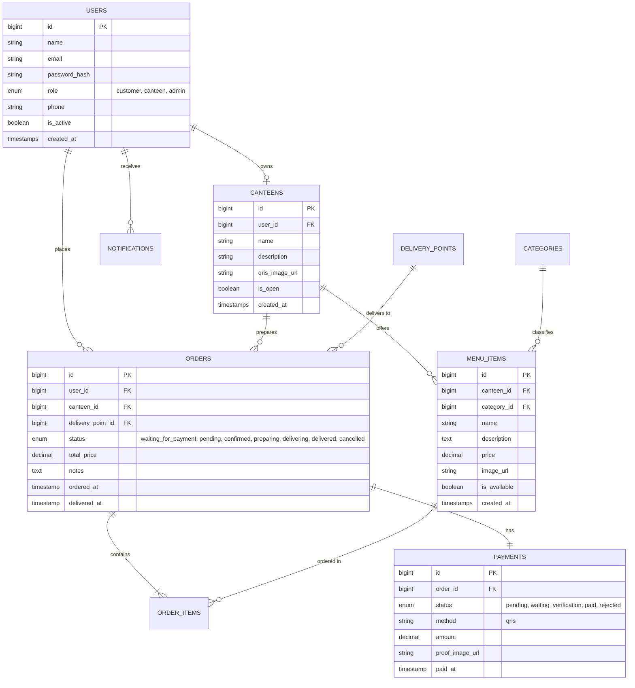

# Daisuke Canteen (Campus Food Delivery System) 🍔🍟

A modern, secure, and robust full-stack web application designed for campus/school ecosystems to manage canteen ordering, delivery points, notifications, and manual QRIS payments with image verification.

---

## 🛠️ Technology Stack

The project is structured as a decoupled monorepo consisting of a modern Next.js client and a secure Laravel API.

### **Frontend (Client)**
* **Framework**: [Next.js 16](https://nextjs.org/) (App Router & React 19)
* **Language**: TypeScript
* **Styling**: [Tailwind CSS v4](https://tailwindcss.com/)
* **UI Components**: [Shadcn UI](https://ui.shadcn.com/) (Radix Primitives & Lucide Icons)
* **State Management**: [Zustand](https://github.com/pmndrs/zustand)
* **Data Fetching/Caching**: [TanStack React Query v5](https://tanstack.com/query/latest) & Axios
* **Form Validation**: React Hook Form & Zod

### **Backend (REST API)**
* **Framework**: [Laravel 13](https://laravel.com/) (PHP 8.3)
* **Authentication**: [Laravel Sanctum](https://laravel.com/docs/sanctum) (Stateful Cookie-based Sessions)
* **Database**: PostgreSQL 16
* **Cloud Storage**: Cloudinary (for menu images & payment proof uploads)
* **Payment Gateway Scaffolding**: Midtrans (PHP SDK)

---

## 🌟 Key Features & Workflows

The application supports three distinct roles, each with custom dashboards and operations:

### **1. Customer Flow**
* **Browse Canteens & Menus**: Real-time listing of active/open canteens, categorised menu items, pricing, and availability.
* **Shopping Cart & Checkout**: Seamless cart system for ordering from a specific canteen with custom notes.
* **Delivery Location Selection**: Choice of predefined delivery points across the campus/building.
* **Manual QRIS Payments**: Checkout generates a canteen-specific QRIS code. Customers can upload payment receipts (images), which are hosted on Cloudinary.
* **Real-time Order Tracking**: Visual progress bar tracking order statuses (`Waiting for Payment` ➡️ `Pending Verification` ➡️ `Confirmed` ➡️ `Preparing` ➡️ `Delivering` ➡️ `Delivered`).
* **Notifications**: Alert system to update users when their payment is approved/rejected or when their order is on the way.

### **2. Canteen Owner Flow**
* **Canteen Control**: Toggle canteen open/close status and update canteen profile details (including their specific QRIS payment QR code).
* **Menu Management**: Full CRUD operations for menu items (name, description, price, availability, category, image).
* **Order Management**: Monitor active incoming orders.
* **Payment Verification**: View uploaded payment proofs, approve or reject transactions, and trigger status updates. Rejection returns the order status to `Waiting for Payment` for customer correction.

### **3. Platform Administrator Flow**
* **User Oversight**: Activate/deactivate accounts (e.g., vetting canteen owners).
* **Platform Analytics**: Dashboard metrics highlighting total users, total active canteens, total completed transactions, and system revenue.

---

## 🔒 Authentication Flow (Laravel Sanctum)

To prevent XSS and token-theft vulnerabilities, the system avoids storing JWT tokens in `localStorage`. Instead, it uses **Secure, Stateful HttpOnly Cookie Authentication** via Laravel Sanctum.



---

## 📊 Database Schema



---

## 🚀 Getting Started

### Prerequisites
Make sure you have [Docker & Docker Compose](https://www.docker.com/) installed on your machine.

---

### **Option 1: Quick Start with Docker (Recommended)**

Orchestrate the entire platform (Database, Adminer, Backend, and Frontend) in one command:

1. **Clone the Repository & Navigate**
   ```bash
   cd webv2
   ```

2. **Configure Environment Variables**
   Create a `.env` file in the root directory:
   ```env
   # Database Config
   DB_NAME=food_delivery
   DB_USER=food_iihsann
   DB_PASSWORD=food_iihsann
   DB_PORT=5433

   # Port Mapping
   ADMINER_PORT=8081
   BACKEND_PORT=8001
   FRONTEND_PORT=3001

   # Laravel API Configuration
   APP_ENV=local
   APP_DEBUG=true
   APP_KEY=base64:hhbrPdO8B9aGqi6+BWQF6PdyRrBuO8D+DzeTKbbrVV8=
   APP_URL=http://localhost:8001

   # Cloudinary Credentials (for uploads)
   CLOUDINARY_CLOUD_NAME=your_cloud_name
   CLOUDINARY_API_KEY=your_api_key
   CLOUDINARY_API_SECRET=your_api_secret

   # Next.js Config
   NEXT_PUBLIC_API_URL=http://localhost:8001/api/v1
   NEXT_PUBLIC_BACKEND_URL=http://localhost:8001

   SANCTUM_STATEFUL_DOMAINS=localhost:3001 
   SESSION_DOMAIN=localhost
   ```

3. **Start the Services**
   ```bash
   docker compose up --build
   ```

4. **Access Ports & Web Services**
   * **Frontend Application**: [http://localhost:3001](http://localhost:3001)
   * **Backend REST API**: [http://localhost:8001](http://localhost:8001)
   * **Adminer (DB Manager)**: [http://localhost:8081](http://localhost:8081) (Host: `postgres`, DB Name: `food_delivery`)

---

### **Option 2: Local Manual Setup**

If you prefer to run services natively on your host machine:

#### **Backend Setup (Laravel)**
1. Navigate to the backend folder:
   ```bash
   cd backend
   ```
2. Install Composer packages:
   ```bash
   composer install
   ```
3. Copy the env file and generate the application key:
   ```bash
   cp .env.example .env
   php artisan key:generate
   ```
4. Set up database credentials in `backend/.env` (pointing to your local Postgres/MySQL) and run migrations:
   ```bash
   php artisan migrate --seed
   ```
5. Run the development environment (spawns API server, queue listener, logs, and hot-reload in parallel):
   ```bash
   composer dev
   ```

#### **Frontend Setup (Next.js)**
1. Navigate to the frontend folder:
   ```bash
   cd ../frontend
   ```
2. Install Node packages:
   ```bash
   npm install
   ```
3. Copy the environment variables:
   ```bash
   cp .env.example .env
   ```
4. Start the Next.js development server:
   ```bash
   npm run dev
   ```

---

## 📡 Core API Routes (`/api/v1`)

| Method | Endpoint | Description | Role / Auth |
| :--- | :--- | :--- | :--- |
| **GET** | `/sanctum/csrf-cookie` | Initialise session & retrieve CSRF token | Guest |
| **POST** | `/auth/register` | Register a new user | Guest |
| **POST** | `/auth/login` | Login to platform | Guest |
| **POST** | `/auth/logout` | Terminate session | Authenticated |
| **GET** | `/auth/me` | Retrieve authenticated user profile | Authenticated |
| **GET** | `/canteens` | List all canteens | Guest |
| **POST** | `/orders` | Place a new order | Customer |
| **POST** | `/payments` | Initialize payment for order | Customer |
| **POST** | `/payments/{id}/proof` | Upload receipt / proof of payment | Customer |
| **PATCH** | `/payments/{id}/verify` | Approve or Reject payment | Canteen Owner |
| **PATCH** | `/orders/{id}/status` | Update order progression status | Canteen Owner |
| **GET** | `/admin/stats` | View global platform analytics | Admin |

---

## 🤝 Contributing & Standards

* Ensure type safety is maintained by adding definitions to `frontend/src/types/`.
* Follow Laravel's PSR-12 coding standard for php components (`composer pint` can be run to format code).
* Maintain cookie-session credentials (`withCredentials: true` or `credentials: 'include'`) on all new API client instances.
